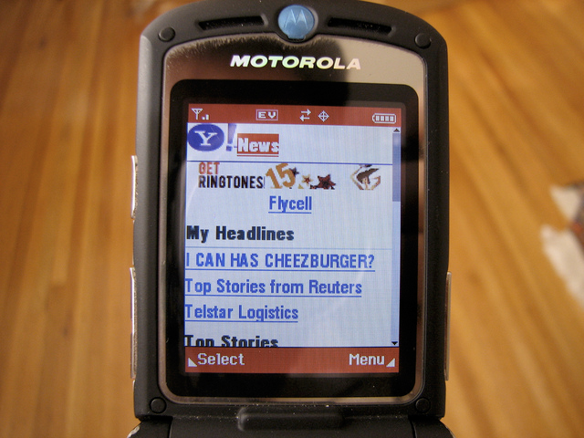
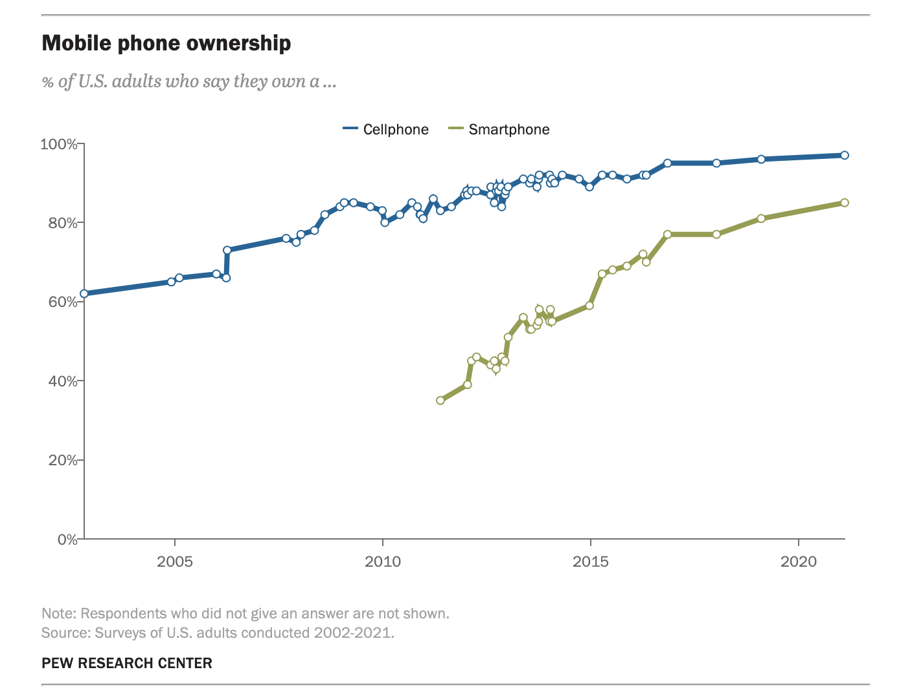

# Responsive Design - Concepts

**Learning objective:** By the end of this lesson, students will be introduced to the concept of responsive web design.

## Background
Not that long ago, building a successful online presence meant just ensuring that your website worked correctly in all the major desktop browsers, and the mobile internet looked like this:

*The mobile internet in 2005. Image: [Wired](https://www.wired.com/2008/07/mobile-browsing/)*

Fast forward to today, and desktop browsing is rapidly being replaced by surfing on mobile devices.

According to [Pew Research](https://www.pewresearch.org/internet/fact-sheet/mobile/), over 85% percent of American adults now own a smartphone, and well over 50% of web pages are served to smartphones **globally**!

*Web sites and applications designed just for desktop displays don't cut it anymore!*

## What is responsive web design and why is it important?

**Responsive Web Design**, as you may have guessed, is a technique for designing and developing websites that can adapt to different screen sizes and devices. It allows us to create sites that look good and function well on all devices. Specifically, the most critical criteria to respond to is the width of the device’s screen.

As technology advances, non "traditional" screen sizes have skyrocketed in popularity, and users are accessing the web from all manner of devices. Designing for different screen sizes ensures that our users have a positive experience on our sites. 

## Benefits and challenges of responsive web design

Like many things, responsive design has benefits and challenges. 

Benefits:
  - **Improved user experience**: RWD (Responsive Web Design) ensures that users have a good experience on our website, regardless of the device they are using. 
  - **Increased reach and traffic**: allows us to reach a wider audience and attract more traffic to your website, as it is now accessible to users on all devices.
  - **Improved SEO**: RWD is beneficial for our website's SEO, as it avoids duplicate content issues and improves loading speed and performance.
  - **Better conversion rates**: can lead to better conversion rates, as users are more likely to convert on a website that is easy to use and navigate.

Challenges:
-  **Complexity**: RWD can be more complex to design and develop than traditional web design, because we need to consider how the website will look and function on a variety of devices.
-  **Design limitations**: since we need to account for the capabilities of different devices, we may encounter design limitations. For example, you may need to use simpler designs and fewer features on mobile devices.
-  **Testing**: to ensure that they look and function as expected, RWD sites need to be tested on a variety of devices which can be time-consuming. 

Despite the challenges, responsive web design is a valuable approach for creating websites that are accessible and user-friendly on all devices. The benefits of RWD outweigh the challenges, and it is an essential consideration for any website owner in today's digital world.
