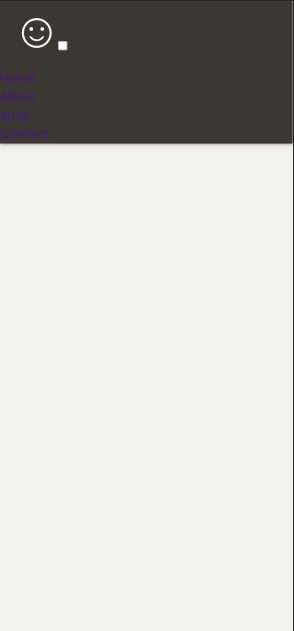
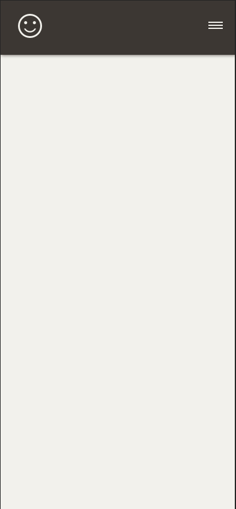
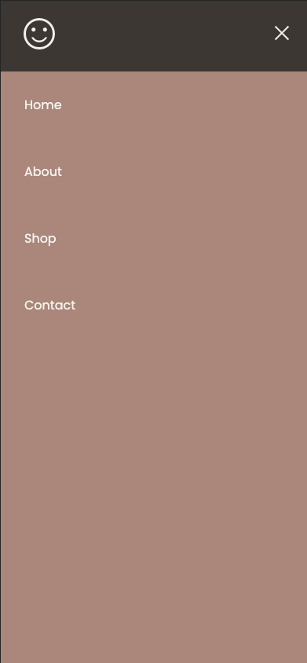
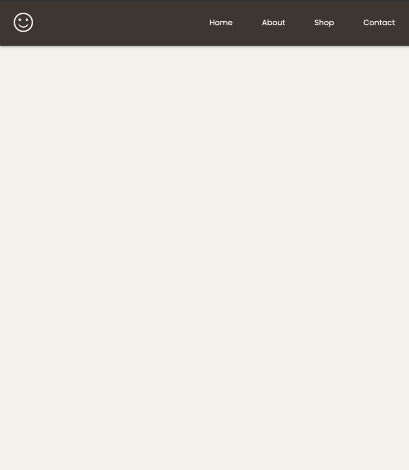

# Responsive Design - Level Up - Functional Hamburger Nav Walkthrough


In order to make our navbar functional using pure CSS, we're going to overhaul most of the code from the [Media Queries](../media-queries/README.md) lesson.

## Setting up our NavBar

In our `index.html` we'll keep our `css/style.css` linked, but above it let's add a Google Fonts `<link>` tag for our logo symbol.

```html
  <link rel="stylesheet"
    href="https://fonts.googleapis.com/css2?family=Material+Symbols+Outlined:opsz,wght,FILL,GRAD@20..48,100..700,0..1,-50..200" />
     <!-- logo icon above this line-->
  <link rel="stylesheet" href="./css/style.css" />
```

We're going for a slightly different look this time, ditching the hamburger emoji for a more classic NavBar style. Replace the HTML between the `<header>` tags with this code:

```html
    <!-- Logo -->
    <a href="#" class="logo"><span class="material-symbols-outlined">
        sentiment_satisfied
      </span></a>
    <!-- Hamburger icon -->
    <input class="side-menu" type="checkbox" id="side-menu" />
    <label class="hamburger" for="side-menu"><span class="hamb-line"></span></label>
    <!-- Menu -->
    <nav class="nav">
      <ul class="menu">
        <li><a href="/">Home</a></li>
        <li><a href="/">About</a></li>
        <li><a href="/">Shop</a></li>
        <li><a href="/">Contact</a></li>
      </ul>
    </nav>
```

To make our hamburger menu work its magic, we'll use a `checkbox input` that'll be visible on mobile devices. This way, we can dynamically style the menu depending on whether the checkbox is checked or not. The `<label>` tag below the checkbox lets us define the icon that represents our hamburger menu.

## Styling our UI

Now it's time to style our NavBar. Delete all rules in your `css/style.css`. and add the following code instead:

```css
/* import our font */
@import url("https://fonts.googleapis.com/css2?family=Poppins:wght@400;700&display=swap"); 

/* reset our css */
*{
    margin: 0;
    padding: 0;
    box-sizing: border-box;
}

body{
    background-color: #f4f3ee;
    font-family: "Poppins", sans-serif;
}

/* remove underline from our links and bullets from our ul */
a{
    text-decoration: none;
}

ul{
    list-style: none;
}
```

Now that we've got some basic css rules, let's add styling to our header and logo:

```css
/* style the header */
.header{
  background-color: #463f3a;
  box-shadow: 1px 1px 5px 0px #8a817c;
  position: sticky;
  top: 0;
  width: 100%;
}

/* position our logo */
.logo{
  display: inline-block;
  color: #f4f3ee;
  font-size: 60px;
  margin-left: 25px;
}

.material-symbols-outlined {
  font-size: .8em;
}

```

By adding `position: sticky` and `top: 0` to our `.logo` class, we're telling the header to stay put at the top of the screen even as we scroll down.

Our CSS styling gives us a somewhat decent-looking NavBar, but there are a couple of issues: the checkbox is visible, and the link text color is hard to read.



Let's fix that!

```css
/* Nav menu */
.nav{
  width: 100%;
  height: 100%;
  position: fixed;
  background-color: #e0afa0;
  overflow: hidden;
}
.menu a{
  display: block;
  padding: 30px;
  color: #f4f3ee;
}
.menu a:hover{
  background-color: #8a817c;
}
.nav{
  max-height: 0;
  transition: max-height .5s ease-out;
}
```

To ensure our `nav` element adapts its content to different screen sizes, we set both `width` and `height` to `100%`. We also use `position: fixed` to make our menu overlay the content that will reside within our `<main>` tag.

We've added a `block` display to our menu links, included the `transition` property for smooth animations, and set a `max-height` of `0` to keep our `nav` element hidden until the checkbox is clicked.

Now it's time to style the hamburger menu:

```css
/* Menu Icon */
.hamburger{
  cursor: pointer;
  float: right;
  padding: 40px 20px;
}/* Style label tag */

.hamb-line {
  background: #f4f3ee;
  display: block;
  height: 2px;
  position: relative;
  width: 24px;

} /* Style span tag */

.hamb-line::before,
.hamb-line::after{
  background: #f4f3ee;
  content: '';
  display: block;
  height: 100%;
  position: absolute;
  transition: all .2s ease-out;
  width: 100%;
}
.hamb-line::before{
  top: 5px;
}
.hamb-line::after{
  top: -5px;
}

.side-menu {
  display: none;
} /* Hide checkbox */
```

In the above code, we styled our `cursor` to display as a `pointer` when a user interacts with our menu. We also positioned our hamburger label to the right of our header, and styled our hamburger icon using the `.hamb-line` class that we placed on our `<span>` tag. 

Notice the use of the `::before` and `::after` pseudo-elements on the `<span>` tag. These allow us to define the appearance of our hamburger icon (the three lines). Specifically, `.hamb-line` styles the middle line, while `.hamb-line::before` and `.hamb-line::after` define the styles for the first and third lines, respectively.

Finally, we hid our checkbox using `display:none` under our `.side-menu` declaration. 

As of now, we have an output that looks like this: 




Now let's make that hamburger icon interactive:

```css
/* Toggle menu icon */
.side-menu:checked ~ nav{
    max-height: 100%;
}
.side-menu:checked ~ .hamburger .hamb-line {
    background: transparent;
}
.side-menu:checked ~ .hamburger .hamb-line::before {
    transform: rotate(-45deg);
    top:0;
}
.side-menu:checked ~ .hamburger .hamb-line::after {
    transform: rotate(45deg);
    top:0;
}
```

First, this code sets the `max-height` of our nav when the checkbox is clicked. 

To enhance the visual feedback for users, we've implemented a clever animation that transforms the three hamburger lines into an 'X' shape when clicked. This visual cue clearly indicates to the user that the menu has been toggled.

We achieve this by setting the `background` of the `.hamb-line` element to `transparent`, effectively hiding the middle line of the hamburger icon. Simultaneously, we use the `transform: rotate` property to rotate the top and bottom lines by 45 degrees clockwise and 45 degrees counter-clockwise, respectively. To learn more about the `transform` property and how to use it, check out the [MDN documentation](https://developer.mozilla.org/en-US/docs/Web/CSS/transform).

Our toggled menu now looks like this:



Onto the last step: Adding responsiveness! 

Since we used a mobile-first design approach, we now need to incorporate media queries to adapt the menu's appearance for users on wider screens.


```css
@media (min-width: 768px) {
  .nav{
      max-height: none;
      top: 0;
      position: relative;
      float: right;
      width: fit-content;
      background-color: transparent;
  }
  .menu li{
      float: left;
  }
  .menu a:hover{
      background-color: transparent;
      color: #8a817c;
  }

  .hamburger{
      display: none;
  }
}  
```

This media query will display the following horizontal NavBar for users on screens that are at least `768px` wide:




Congrats! Now you have a fully responsive hamburger menu. Head over to the [Product Cards Flexbox](./product-cards-flex.md) level up to learn how to implement responsiveness with flexbox alone -- no media queries required!

